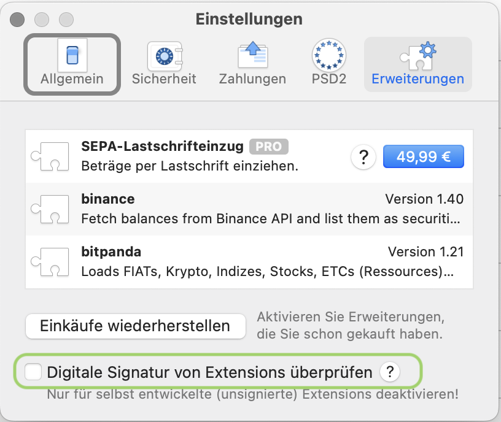
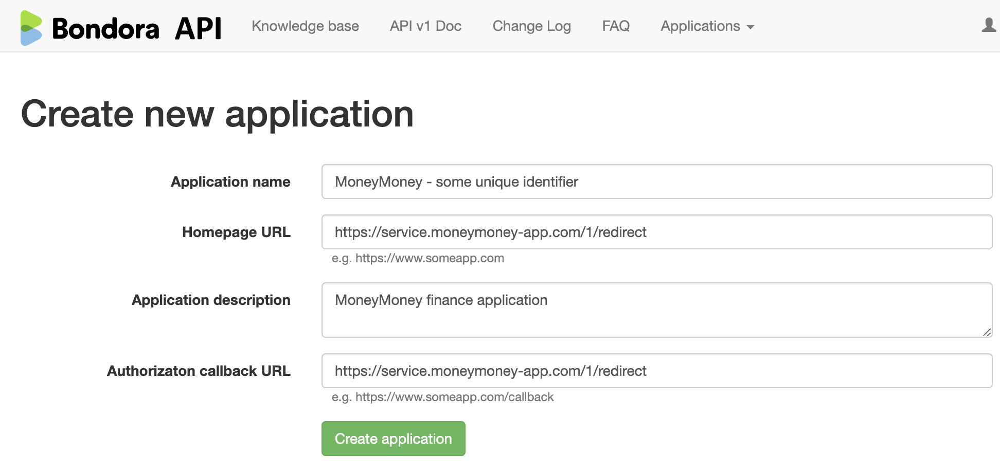
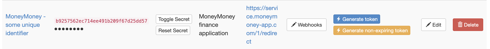
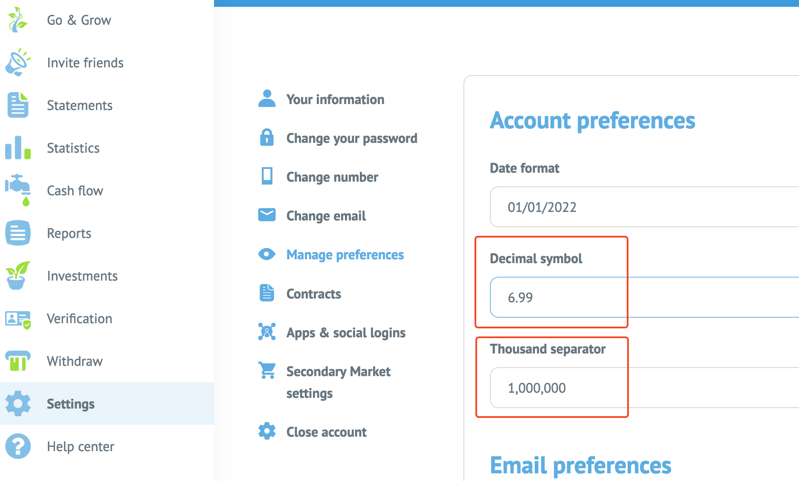

# moneymoney-bondora-oauth
MoneyMoney Extension for Bondora using the API and OAuth2.
The extension will provide the balance of your Go&Grow accounts and your other accounts (Portfolio Pro, Portfolio Manager, Manual investments, API investments).

The implementation is inspired by:
* https://github.com/diederich/moneymoney-monzo for handling OAuth2 in MoneyMoney
* https://github.com/EmDee/moneymoney-bondora for Bondora API features

## Installation
### Signed Version
* Download the extension from the official [extensions page](https://moneymoney-app.com/extensions/)
* In MoneyMoney go to Help > Show database in finder (German: Hilfe > Datenbank im Finder zeigen)
* Add the downloaded Bondora-OAuth2.lua file to the directory "Extensions"

### Unsigned Version
* Download the extension from this repository
* In MoneyMoney go to Help > Show database in finder (German: Hilfe > Datenbank im Finder zeigen)
* Add the downloaded Bondora-OAuth2.lua file to the directory "Extensions"
* Deactivate the signature check
  
  

## Usage

### Preparation: Create application in your Bondora API settings
Create an application with the following values by navigating to api.bondora.com > Applications > Create New 
* Application name must be unique. Choose something like "MoneyMoney - YourName" or whatever you want. This value is never used in the extension. You get an error message if any other user already used your chosen value.
* Homepage URL: https://service.moneymoney-app.com/1/redirect
* Application description: Choose some text to describe the access, i.e. "Access for MoneyMoney finance app"
* Authorization callback URL: https://service.moneymoney-app.com/1/redirect 

### Create Account in MoneyMoney
* Add a new account and select 'Bondora Account (OAuth2)" in the 'Others' category.
* Enter the following values from your API application settings: 
    * Client ID as username 
    * Client Secret as password

## Limitations
TODO: remove this limitation
### Bondora Preferences
This extension will only work, if your English preferences for decimal and thousand separator are following the default setting:

### API Rate Limiting
Bondora has an API rate limiting so there is a 429 http error response if the API is called too often.
To work around this, the extension caches the response. But in general the 429 error is not yet handled in the code.
Especially the response of the investments endpoint is quite large. So storing this in the LocalStorage should be optimized.
TODO: Optimizing storing investments response (in LocalStorage)

## To clarify with MoneyMoney development team
* Is using LocalStorage with big data a problem (for the performance of MoneyMoney for example)?
* HTTP 429 is catched by MoneyMoney itself, access in the script seems not possible. Is there a way to handle this http response code?